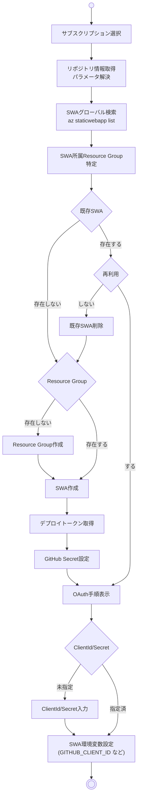

# New-SwaResources.ps1 動作設計書

## 概要

このドキュメントは `New-SwaResources.ps1` スクリプトの動作仕様を定義します。
スクリプトは Azure Static Web App のプロビジョニングと GitHub OAuth 設定を統合的に処理します。

## 前提条件

- Azure CLI / GitHub CLIがインストール済みで、`az login` / `gh auth login` が完了していること
- `git` が利用可能で、`git remote get-url origin` がGitHubホスト名を含むURLを返すこと
- 実行開始時に `az account show` で現在のサブスクリプションを取得し、必要なら `az account list` の候補から番号入力で再選択する
- 選択したサブスクリプションIDを `az ... --subscription <id>` で明示指定し、誤ったテナントにリソースを作成しない

### 用語

- SWA = Static Web App

## 入力パラメーター

| パラメーター | 型 | 必須 | デフォルト | 説明 |
|-----------|-----|------|-----------|------|
| `ResourceGroupName` | string | No | `rg-<repo>-prod` | リソースグループ名 |
| `Name` | string | No | `stapp-<repo>-prod` | Static Web App 名 |
| `ResourceGroupLocation` | string | No | `japaneast` | リソースグループのリージョン |
| `Sku` | string | No | `Standard` | Static Web App の SKU (Free/Standard) |
| `ClientId` | string | No | - | GitHub OAuth App Client ID |
| `ClientSecret` | string | No | - | GitHub OAuth App Client Secret |

## 処理フロー

### サブスクリプション選択の詳細

1. `az account show` で現在のサブスクリプション名/IDを取得し、使用可否を Y/N で確認する。
2. 切り替えを希望された場合は `az account list` の結果をすべて番号付きで表示し、無効入力や未入力の場合は有効値が得られるまで再入力を要求する。
3. 選択した ID はスクリプト内の各 `az` コマンドへ `--subscription <ID>` として明示指定し、Azure CLI の既定サブスクリプションは切り替えない。別ターミナルで同サブスクリプションを扱いたい場合は、利用者が必要に応じて `az account set` を手動で実行する。

`SetGHSecret` ステップでは GitHub CLI (`gh secret set`) を利用して `AZURE_STATIC_WEB_APPS_API_TOKEN` を対象リポジトリへ登録するため、ローカル側で `gh` のセットアップと認証が事前に済んでいることを前提とする。既存の Static Web App を再利用する場合でも、`az staticwebapp secrets list` で最新のデプロイ トークンを取得し直し、GitHub シークレットへ必ず書き戻す。
