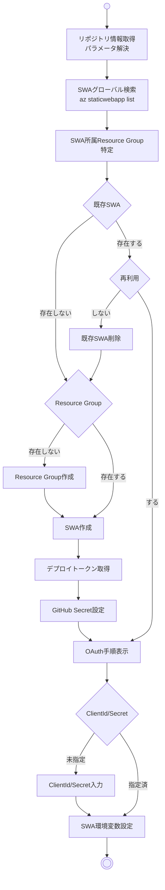

# New-SwaResources.ps1 動作設計書

## 概要

このドキュメントは `New-SwaResources.ps1` スクリプトの動作仕様を定義します。
スクリプトは Azure Static Web App のプロビジョニングと GitHub OAuth 設定を統合的に処理します。

### 用語

- SWA = Static Web App

## 入力パラメータ

| パラメータ | 型 | 必須 | デフォルト | 説明 |
|-----------|-----|------|-----------|------|
| `ResourceGroupName` | string | No | `rg-<repo>-prod` | リソースグループ名 |
| `Name` | string | No | `stapp-<repo>-prod` | Static Web App 名 |
| `ResourceGroupLocation` | string | Yes | `japaneast` | リソースグループのリージョン |
| `Sku` | string | No | `Standard` | Static Web App の SKU (Free/Standard/Dedicated) |
| `ClientId` | string | No | - | GitHub OAuth App Client ID |
| `ClientSecret` | string | No | - | GitHub OAuth App Client Secret |

## 処理フロー

