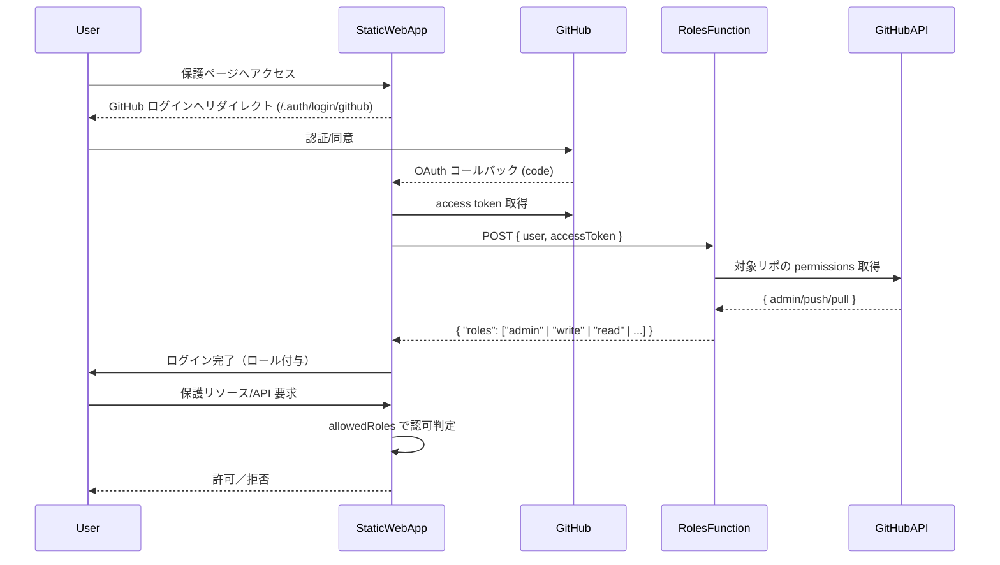

# SWA GitHub Repo Roles (GitHub リポ権限ベース認可 for Azure Static Web Apps)

> **目的**: Azure Static Web Apps (SWA) で GitHub の**特定リポジトリに対する権限（admin / write / read）**を元にアクセスを制御する。
> **構成**: カスタム GitHub OAuth + `rolesSource`（Node.js Azure Functions）+ `staticwebapp.config.json` の `allowedRoles`

---

## 目次

* [アーキテクチャ](#アーキテクチャ)
* [前提条件](#前提条件)
* [クイックスタート](#クイックスタート)
* [SWA 設定 (`staticwebapp.config.json`)](#swa-設定-staticwebappconfigjson)
* [ロール割当 Function 実装（Node.js）](#ロール割当-function-実装nodejs)
* [ルート／API の保護](#ルートapi-の保護)
* [ローカル開発 & 検証](#ローカル開発--検証)
* [トラブルシュート](#トラブルシュート)
* [セキュリティとベストプラクティス](#セキュリティとベストプラクティス)
* [ライセンス](#ライセンス)

---

## アーキテクチャ



---

## 前提条件

* **Azure Static Web Apps: Standard プラン**（カスタム認証・`rolesSource` 必須）
* **GitHub OAuth App**（Callback URL: `https://<YOUR-SWA>.azurestaticapps.net/.auth/login/github/callback`）
* **Azure Functions (Node.js)**：SWA の `api/` でホスト
* **対象 GitHub リポジトリ**：権限を判定する *1 リポジトリ*
* （プライベートリポ想定）OAuth スコープ **`repo`** を要求

## 環境情報

- [SECRET.json](/SECRET.json)

---

## クイックスタート

```bash
# 1) リポジトリをクローン
git clone <this-repo>
cd <this-repo>

# 2) Functions 依存パッケージ（Octokit 等）
cd api
npm install
cd ..

# 3) フロントエンド（`web/` 以下）の静的コンテンツを編集
#    例: web/index.html

# 4) SWA CLI で起動（任意）
# npx swa start --app-location web --api-location api
```

1. **GitHub OAuth App** の Client ID/Secret を取得
2. **SWA の App Settings** に以下を登録

   * `GITHUB_CLIENT_ID` = (Client ID)
   * `GITHUB_CLIENT_SECRET` = (Client Secret)
   * `GITHUB_CLIENT_SECRET_APP_SETTING_NAME` = `GITHUB_CLIENT_SECRET`
   * `REPO_OWNER` / `REPO_NAME` = 対象リポ（Functions 用）
3. `staticwebapp.config.json` をルートに配置（`routes` や `rolesSource` を設定）し、`appLocation: "web"` でデプロイ
4. ログイン → `/.auth/me` で `userRoles` に `admin|write|read` が付与されているか確認

---

## SWA 設定 (`staticwebapp.config.json`)

> SWA の組み込み GitHub 認証を**自前 OAuth App**に切替え、ログイン毎に `rolesSource` を呼び出して**カスタムロール**を付与します。

```json
{
  "$schema": "https://json.schemastore.org/staticwebapp.config.json",
  "auth": {
    "rolesSource": "/api/GetRoles",
    "identityProviders": {
      "github": {
        "registration": {
          "clientIdSettingName": "GITHUB_CLIENT_ID",
          "clientSecretSettingName": "GITHUB_CLIENT_SECRET_APP_SETTING_NAME"
        },
        "login": {
          "scopes": ["repo"]
        }
      }
    }
  },
  "routes": [
    { "route": "/admin/*",       "allowedRoles": ["admin"] },
    { "route": "/contributors/*","allowedRoles": ["admin","write"] },
    { "route": "/readers/*",     "allowedRoles": ["admin","write","read"] },
    { "route": "/",              "allowedRoles": ["authenticated"], "rewrite": "/index.html" }
  ],
  "navigationFallback": {
    "rewrite": "/index.html",
    "exclude": ["/api/*"]
  },
  "responseOverrides": {
    "401": {
      "statusCode": 302,
      "redirect": "/.auth/login/github?post_login_redirect_uri=.referrer"
    }
  }
}
```

> **注意**: `clientSecretSettingName` は**設定キー名**であり、**秘密値そのものではありません**。`GITHUB_CLIENT_SECRET` を別途 App Settings に作成し、そのキー名をここで参照します。

---

## ロール割当 Function 実装（Node.js）

> `api/GetRoles/index.js`：GitHub トークンで対象リポの **permissions**（`admin`/`push`/`pull`）を取得 → 最上位ロールを 1 つ返却（必要なら複数付与でも可）

**ディレクトリ構成（抜粋）**

```
/api
  /GetRoles
    function.json
    index.js
  package.json
```

**`api/GetRoles/function.json`**

```json
{
  "bindings": [
    {
      "authLevel": "anonymous",
      "type": "httpTrigger",
      "direction": "in",
      "name": "req",
      "methods": [ "post" ],
      "route": "GetRoles"
    },
    {
      "type": "http",
      "direction": "out",
      "name": "res"
    }
  ]
}
```

**`api/GetRoles/index.js`**

```js
const { Octokit } = require("@octokit/rest");

const REPO_OWNER = process.env.REPO_OWNER || "<YOUR_ORG_OR_USERNAME>";
const REPO_NAME  = process.env.REPO_NAME  || "<TARGET_REPO_NAME>";

module.exports = async function (context, req) {
  const user = req.body || {};
  const token = user.accessToken;        // SWA から渡される GitHub アクセストークン
  const githubUsername = user.userDetails; // 参考: GitHub username

  let roles = [];
  if (!token) {
    context.log("No GitHub access token provided to GetRoles.");
  } else {
    try {
      const octokit = new Octokit({ auth: token });
      const { data: repo } = await octokit.repos.get({
        owner: REPO_OWNER,
        repo: REPO_NAME
      });
      if (repo.permissions) {
        if (repo.permissions.admin) {
          roles.push("admin");
        } else if (repo.permissions.push) {
          roles.push("write");
        } else if (repo.permissions.pull) {
          roles.push("read");
        }
      }
    } catch (err) {
      context.log.error("GitHub API error or access denied:", err.message);
      // プライベートで非コラボレータ等 → 403/404 → ロール無し（認可不可）
    }
  }

  context.res = {
    status: 200,
    headers: { "Content-Type": "application/json" },
    body: { roles }
  };
};
```

**`api/package.json`（抜粋）**

```json
{
  "name": "swa-github-repo-roles-api",
  "private": true,
  "version": "1.0.0",
  "dependencies": {
    "@octokit/rest": "^21.0.0"
  }
}
```

> **環境変数**: `REPO_OWNER` / `REPO_NAME` は Functions へ流入（SWA の App Settings → Functions 環境）。

---

## ルート／API の保護

* `allowedRoles` は **静的ルート** と **/api** の両方で機能
* SWA は API 呼び出しに `x-ms-client-principal` を自動付与（Base64 JSON: `userDetails`, `userRoles` 等）
* 関数側で必要なら復号して利用可能

**API 内でのユーザー参照（任意）**

```js
const header = req.headers["x-ms-client-principal"];
if (header) {
  const decoded = Buffer.from(header, "base64").toString("utf-8");
  const principal = JSON.parse(decoded);
  // principal.userDetails / principal.userRoles
}
```

---

## ローカル開発 & 検証

* **SWA CLI**: `npx swa start`

  * ローカルでフロント＋Functions を起動
  * 認証エミュレーターでダミーロールを付与しルール検証可
* **動作確認**:

  1. GitHub でログイン
  2. `/.auth/me` を開き `userRoles` を確認
  3. `/admin/*` などをアクセスして認可動作を確認

---

## トラブルシュート

* **ログイン後にロールが付かない**

  * `rolesSource` ルートが正しくデプロイされているか
  * Functions のログに GitHub API エラー（403/404）が出ていないか
  * OAuth スコープ `repo` が付与されているか（プライベートリポ）
* **すべて 401 になる**

  * `allowedRoles` が厳しすぎないか（最低限 `authenticated` で表示すべきページの確認）
  * `responseOverrides.401.redirect` の指定でループしていないか
* **Functions に到達しない**

  * API ルートにも `allowedRoles` を設定している場合、事前認可で弾かれていないか
  * `rolesSource` の実行は**ログイン時のみ**。通常の API 呼び出しは別経路
* **公開リポで誰でも read になってしまう**

  * `repo.permissions.pull` はパブリックで true になり得る
  * 「コラボレータのみ」を想定する場合は**リポが private であることを要件化**、または `collaborators` API を併用し明示判定

---

## セキュリティとベストプラクティス

* **秘密情報は App Settings / Key Vault** に保存（`clientSecretSettingName` は**キー名参照**）
* **最小権限**: 守るべきページは `authenticated` ではなく**カスタムロール**で保護
* **キャッシュ**: ログイン時のみ実行のため通常不要だが、大量アクセスで最適化したい場合は短期キャッシュも検討
* **監査**: Functions の `context.log` で権限判定結果・失敗要因を記録
* **プラン**: カスタム認証／`rolesSource` は Standard プラン必須

---

## ライセンス

MIT（予定）
※本リポジトリのコード例は自己責任でご利用ください。GitHub API 利用規約および組織のセキュリティポリシーに従って運用してください。

---

### 付録：想定リポ構成

```
.
├─ web/                       # SWA に配信する静的コンテンツ（index.html など）
├─ api/
│  └─ GetRoles/
│     ├─ function.json
│     └─ index.js
│  └─ package.json
├─ staticwebapp.config.json
├─ README.md
└─ LICENSE
```

---
