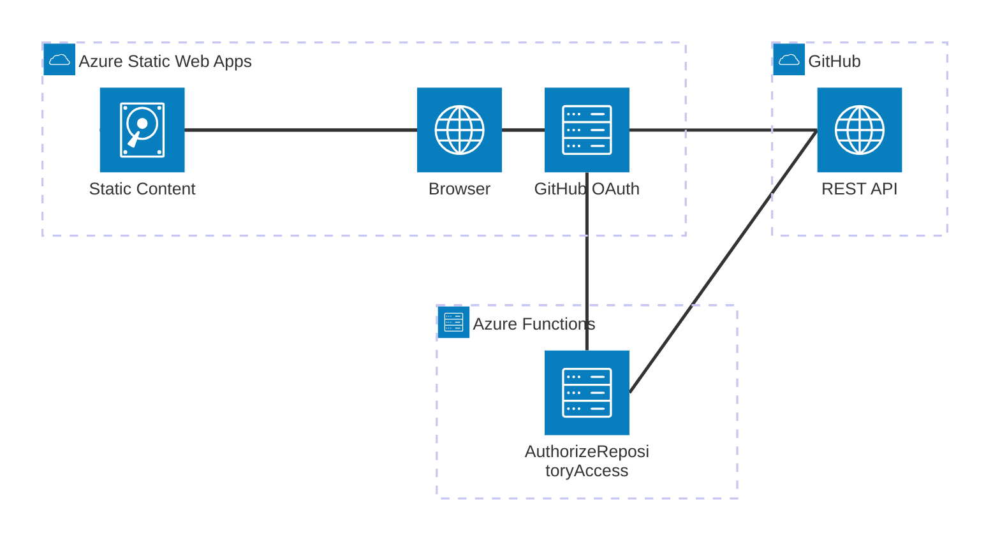
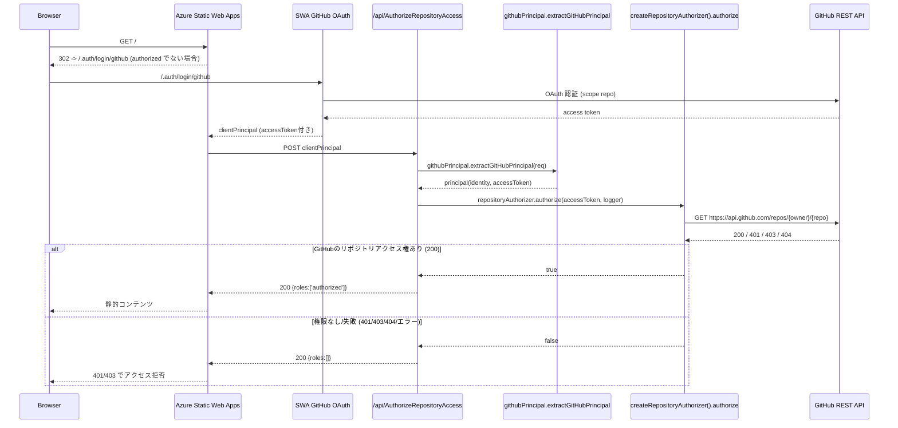

# Azure Static Web Apps - GitHub認証サンプル

[](https://github.com/nuitsjp/swa-github-repo-auth/actions)
[](https://opensource.org/licenses/MIT)
[](https://github.com/nuitsjp/swa-github-repo-auth/graphs/commit-activity)
[](https://azure.microsoft.com/services/app-service/static/)

## 📋 目次

- [🎯 概要](#-概要)
- [✨ 主な機能](#-主な機能)
- [📋 前提条件](#-前提条件)
- [🏗️ アーキテクチャ](#️-アーキテクチャ)
- [🔧 構築手順](#-構築手順)
- [📐 設計詳細](#-設計詳細)
- [💻 開発環境](#-開発環境)
- [🧪 テスト](#-テスト)
- [🚀 デプロイメント](#-デプロイメント)
- [🔍 トラブルシューティング](#-トラブルシューティング)
- [📚 参考資料](#-参考資料)
- [📄 ライセンス](#-ライセンス)

## 🎯 概要

GitHubリポジトリのread権限を持つユーザーのみにAzure Static Web Apps (SWA)でホスティングしたサイトへのアクセスを許可するカスタム認証の実装例です。

### なぜこのソリューションが必要か

ソフトウェア開発時に利用するドキュメントを、Markdownで記述する場合、静的サイトジェネレーターを利用してHTMLに変換し、いずれかの方法でホスティングして提供したい場合があります。

第一候補となるのはGitHub Pagesですが、Azure Static Web Apps (SWA)を利用することで：
- Pull Requestごとにステージング環境でプレビュー可能
- より柔軟な認証・認可の実装が可能
- Azure Functionsとの統合によるサーバーレスAPIの活用

ただし、SWAの組み込み認証機能だけでは、特定のGitHubリポジトリに対するread権限を持つユーザーだけに閲覧を許可することはできません。

### ソリューション

このリポジトリでは、GitHub OAuthを利用した認可するカスタム認証の実装例を提供します：
- **PowerShellスクリプト**: SWAリソースの作成とGitHubシークレット/アプリ設定の登録を自動化
- **カスタム認証実装**: GitHub OAuthを利用した認可ロジック
- **npmパッケージ**: Functions用の再利用可能なハンドラーを `packages/swa-github-auth` として提供

## 📦 npmパッケージ構成

Azure Functions側のロジックは npm パッケージ `@swa-github-repo-auth/swa-github-auth` に切り出しています。ルートの npm ワークスペースで管理しているため、以下のように利用します。

```bash
npm install

# Functions 単体で依存関係を再インストールする場合（ワークスペース指定）
npm ci --workspace api --include-workspace-root=false
```

Functions プロジェクトでは次のようにハンドラーを取り込みます。

```javascript
const { createDefaultHandler } = require('@swa-github-repo-auth/swa-github-auth');

module.exports = createDefaultHandler();
```

パッケージ単体でのユニットテスト/ビルドにも対応できるよう `packages/swa-github-auth` に README と CHANGELOG を配置しています。

## ✨ 主な機能

- 🔐 **GitHub OAuth統合**: リポジトリのread権限に基づくアクセス制御
- 🚀 **自動デプロイメント**: GitHub Actionsによる継続的デプロイメント
- 🔧 **Infrastructure as Code**: PowerShellによるリソース作成の自動化
- 📊 **ロール管理**: Azure Functionsによる動的ロール判定
- 🛡️ **セキュリティ**: アクセストークンの安全な管理とスコープ制限

## 📋 前提条件

### 必須要件

- **Azure サブスクリプション**
  - Azure Static Web AppsのStandardプラン利用可能
  - リソース作成権限
  
- **GitHub アカウント**
  - OAuth App作成権限
  - リポジトリへのアクセス権限

### 開発環境

- **OS**: Windows 11 / macOS / Linux
- **ツール**:
  - Azure CLI (v2.50+)
  - GitHub CLI (v2.0+)
  - PowerShell 7+
  - Node.js 18+ (Azure Functions開発用)
  - npm または yarn

## 🏗️ アーキテクチャ

### システム構成図



### 認証フロー



## 🔧 構築手順

### 1. リポジトリの準備

```bash
# リポジトリをクローン
git clone https://github.com/nuitsjp/swa-github-repo-auth.git
cd swa-github-repo-auth

# ワークスペース全体の依存関係をインストール
npm install
```

### 2. GitHub OAuth Appの作成

1. GitHubの[Developer settings](https://github.com/settings/developers)にアクセス
2. "New OAuth App"をクリック
3. 以下の情報を入力:
   - **Application name**: `SWA GitHub Auth`
   - **Homepage URL**: `https://<your-swa-name>.azurestaticapps.net`
   - **Authorization callback URL**: `https://<your-swa-name>.azurestaticapps.net/.auth/login/github/callback`
4. Client IDとClient Secretを保存

### 3. Azure リソースの作成

PowerShellスクリプトを使用した自動デプロイ:

```pwsh
cd scripts
./New-SwaResources.ps1
```

#### スクリプトパラメータ

| パラメータ | 説明 | 既定値 |
| --- | --- | --- |
| `-ResourceGroupName` | リソースグループ名 | `rg-<repo>-prod` |
| `-Name` | Static Web Apps リソース名 | `stapp-<repo>-prod` |
| `-ResourceGroupLocation` | リージョン | `japaneast` |
| `-SubscriptionId` | サブスクリプションID | 対話選択 |
| `-Sku` | SKU (Free/Standard) | `Standard` |
| `-ClientId` | GitHub OAuth Client ID | 対話入力 |
| `-ClientSecret` | GitHub OAuth Client Secret | セキュア入力 |

#### カスタムパラメータでの実行例

```pwsh
./New-SwaResources.ps1 `
  -ResourceGroupName "rg-my-docs-prod" `
  -Name "stapp-my-docs-prod" `
  -ResourceGroupLocation "japaneast" `
  -Sku "Standard" `
  -ClientId "<YOUR_CLIENT_ID>" `
  -ClientSecret "<YOUR_CLIENT_SECRET>"
```

### 4. 環境変数の設定

Azure ポータルまたはAzure CLIで以下のアプリ設定を構成:

```bash
az staticwebapp appsettings set \
  --name <your-swa-name> \
  --setting-names \
    GITHUB_CLIENT_ID='<your-client-id>' \
    GITHUB_CLIENT_SECRET='<your-client-secret>' \
    REPO_OWNER='<repository-owner>' \
    REPO_NAME='<repository-name>'
```

## 📐 設計詳細

### ディレクトリ構造

```
swa-github-repo-auth/
├── api/                              # Azure Functions
│   ├── AuthorizeRepositoryAccess/   # ロール判定関数
│   │   ├── function.json
│   │   └── index.js
│   ├── lib/                         # 共通ライブラリ
│   │   ├── githubPrincipal.js      # GitHub認証情報処理
│   │   └── repositoryAuthorizer.js  # リポジトリアクセス判定
│   ├── __tests__/                   # テストスイート
│   └── package.json
├── docs/                             # 静的コンテンツ
│   ├── index.html                   # メインページ
│   ├── admin/                       # 管理者向けページ
│   └── signed-out/                  # サインアウトページ
├── scripts/                          # 自動化スクリプト
│   └── New-SwaResources.ps1        # リソース作成スクリプト
├── staticwebapp.config.json         # SWA設定
└── README.md
```

### 主要コンポーネント

#### 1. AuthorizeRepositoryAccess Function

- **役割**: GitHubアクセストークンを使用してリポジトリアクセス権限を検証
- **エンドポイント**: `/api/AuthorizeRepositoryAccess`
- **入力**: SWAからのclientPrincipal
- **出力**: ロール配列 (`['authorized']` または `[]`)

#### 2. githubPrincipal モジュール

- **役割**: clientPrincipalからGitHub認証情報を抽出
- **主要メソッド**: `extractGitHubPrincipal(req)`
- **処理内容**:
  - GitHubプロバイダーの検証
  - アクセストークンの存在確認
  - ユーザー情報の正規化

#### 3. repositoryAuthorizer モジュール

- **役割**: GitHub APIを使用したリポジトリアクセス権限の検証
- **主要メソッド**: `authorize(accessToken, logger)`
- **処理内容**:
  - GitHub REST APIへのリクエスト
  - HTTPステータスコードの評価
  - エラーハンドリング

### 設定ファイル

#### staticwebapp.config.json

```json
{
  "auth": {
    "rolesSource": "/api/AuthorizeRepositoryAccess",
    "identityProviders": {
      "github": {
        "registration": {
          "clientIdSettingName": "GITHUB_CLIENT_ID",
          "clientSecretSettingName": "GITHUB_CLIENT_SECRET_APP_SETTING_NAME"
        }
      }
    }
  },
  "routes": [
    {
      "route": "/admin/*",
      "allowedRoles": ["authorized"]
    }
  ]
}
```

## 💻 開発環境

### ローカル開発サーバーの起動

```bash
# Static Web Apps CLIを使用した統合環境の起動
npx swa start --api-location api --swa-config staticwebapp.config.json

# ブラウザで http://localhost:4280 にアクセス
```

### API開発

```bash
cd api

# 依存関係のインストール
npm install

# Azure Functions Core Toolsでのローカル実行
func start

# 環境変数の設定 (local.settings.json)
{
  "IsEncrypted": false,
  "Values": {
    "FUNCTIONS_WORKER_RUNTIME": "node",
    "GITHUB_CLIENT_ID": "<your-client-id>",
    "GITHUB_CLIENT_SECRET": "<your-client-secret>",
    "REPO_OWNER": "<repo-owner>",
    "REPO_NAME": "<repo-name>"
  }
}
```

## 🧪 テスト

### ユニットテストの実行

```bash
npm test --workspace api

# カバレッジレポート付き
npm test --workspace api -- --coverage --runInBand

# 特定のテストファイルの実行
npm test --workspace api -- __tests__/githubPrincipal.test.js
```

### 統合テスト

1. ローカル環境を起動:
   ```bash
   npx swa start --api-location api
   ```

2. 認証エンドポイントの確認:
   ```bash
   # 認証状態の確認
   curl http://localhost:4280/.auth/me
   
   # ロール保護されたルートへのアクセステスト
   curl http://localhost:4280/admin/
   ```

### E2Eテストのチェックリスト

- [ ] 未認証ユーザーのリダイレクト
- [ ] GitHub OAuth認証フロー
- [ ] リポジトリアクセス権限の検証
- [ ] ロールベースのアクセス制御
- [ ] サインアウト機能

## 🚀 デプロイメント

### GitHub Actions経由のデプロイ

1. GitHubリポジトリの設定でSecretsを追加:
   - `AZURE_STATIC_WEB_APPS_API_TOKEN`

2. mainブランチへのプッシュで自動デプロイ:
   ```bash
   git add .
   git commit -m "feat: Update configuration"
   git push origin main
   ```

### 手動デプロイ

```bash
# Azure CLIを使用したデプロイ
az staticwebapp deployment token show \
  --name <your-swa-name> \
  --resource-group <your-rg-name> \
  --query "value" -o tsv

# SWA CLIを使用
swa deploy \
  --deployment-token <token> \
  --app-location . \
  --api-location api \
  --output-location docs
```

## 🔍 トラブルシューティング

### よくある問題と解決策

#### 1. 認証後もアクセスが拒否される

**原因**: リポジトリへのread権限がない、またはトークンのスコープが不足

**解決策**:
- GitHub OAuth Appのスコープに `repo` が含まれていることを確認
- ユーザーがリポジトリへのアクセス権限を持っていることを確認
- Azure Functions のログで権限チェックの結果を確認

#### 2. ローカル環境で認証が機能しない

**原因**: SWA CLIの認証エミュレーターの制限

**解決策**:
```bash
# 認証エミュレーターを有効化して起動
npx swa start --api-location api --auth-provider github
```

#### 3. Azure Functionsが起動しない

**原因**: 依存関係の不足または設定の誤り

**解決策**:
```bash
cd api
rm -rf node_modules
npm install
func start --verbose
```

#### 4. サインアウトが完了しない

**原因**: GitHubセッションが別管理

**解決策**:
1. `/signed-out/` ページの「アプリの認証情報を再度削除」をクリック
2. 「GitHubをログアウト」リンクからGitHubもサインアウト

### ログの確認方法

```bash
# Azure Functions のログストリーミング
az webapp log tail \
  --name <your-function-app-name> \
  --resource-group <your-rg-name>

# Application Insights クエリ (設定済みの場合)
az monitor app-insights query \
  --app <your-app-insights-name> \
  --query "traces | where timestamp > ago(1h)"
```

## 📚 参考資料

### 公式ドキュメント

- [Azure Static Web Apps Documentation](https://docs.microsoft.com/azure/static-web-apps/)
- [Azure Static Web Apps Authentication](https://docs.microsoft.com/azure/static-web-apps/authentication)
- [Azure Functions JavaScript Developer Guide](https://docs.microsoft.com/azure/azure-functions/functions-reference-node)
- [GitHub OAuth Apps Documentation](https://docs.github.com/developers/apps/building-oauth-apps)

### 関連リポジトリ

- [ソースコード (本リポジトリ)](https://github.com/nuitsjp/swa-github-repo-auth)
- [Azure Static Web Apps CLI](https://github.com/Azure/static-web-apps-cli)

### コミュニティリソース

- [Azure Static Web Apps Community](https://github.com/Azure/static-web-apps/discussions)
- [Stack Overflow - Azure Static Web Apps](https://stackoverflow.com/questions/tagged/azure-static-web-apps)

## 📄 ライセンス

このプロジェクトはMITライセンスの下で公開されています。詳細は[LICENSE](LICENSE)ファイルを参照してください。

---

**問い合わせ**: Issues や Pull Requests は [GitHub リポジトリ](https://github.com/nuitsjp/swa-github-repo-auth) にてお受けしています。
