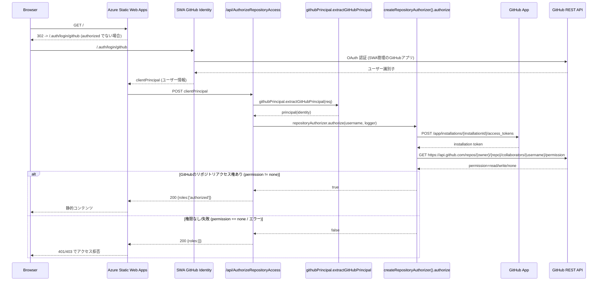

# Azure Static Web Apps - GitHub認証サンプル

[](https://github.com/nuitsjp/swa-github-repo-auth/actions)
[](https://opensource.org/licenses/MIT)
[](https://github.com/nuitsjp/swa-github-repo-auth/graphs/commit-activity)
[](https://azure.microsoft.com/services/app-service/static/)

## 📋 目次

- [🎯 概要](#-概要)
- [✨ 主な機能](#-主な機能)
- [📋 前提条件](#-前提条件)
- [🏗️ アーキテクチャ](#️-アーキテクチャ)
- [🔧 構築手順](#-構築手順)
- [📐 設計詳細](#-設計詳細)
- [💻 開発環境](#-開発環境)
- [🧪 テスト](#-テスト)
- [🚀 デプロイメント](#-デプロイメント)
- [🔍 トラブルシューティング](#-トラブルシューティング)
- [📚 参考資料](#-参考資料)
- [📄 ライセンス](#-ライセンス)

## 🎯 概要

GitHubリポジトリのread権限を持つユーザーのみにAzure Static Web Apps (SWA)でホスティングしたサイトへのアクセスを許可するカスタム認証の実装例です。

### なぜこのソリューションが必要か

ソフトウェア開発時に利用するドキュメントを、Markdownで記述する場合、静的サイトジェネレーターを利用してHTMLに変換し、いずれかの方法でホスティングして提供したい場合があります。

第一候補となるのはGitHub Pagesですが、Azure Static Web Apps (SWA)を利用することで：
- Pull Requestごとにステージング環境でプレビュー可能
- より柔軟な認証・認可の実装が可能
- Azure Functionsとの統合によるサーバーレスAPIの活用

ただし、SWAの組み込み認証機能だけでは、特定のGitHubリポジトリに対するread権限を持つユーザーだけに閲覧を許可することはできません。

### ソリューション

このリポジトリでは、GitHub Apps を利用して GitHub リポジトリの権限を確認するカスタム認証の実装例を提供します：
- **PowerShellスクリプト**: SWAリソースの作成とGitHubアプリ設定の登録を自動化
- **カスタム認証実装**: GitHub App のインストールトークンでリポジトリ権限を検証

## ✨ 主な機能

- 🔐 **GitHub Apps統合**: メタデータ読み取り権限のみでリポジトリへのアクセス可否を判定
- 🚀 **自動デプロイメント**: GitHub Actionsによる継続的デプロイメント
- 🔧 **Infrastructure as Code**: PowerShellによるリソース作成の自動化
- 📊 **ロール管理**: Azure Functionsによる動的ロール判定
- 🛡️ **セキュリティ**: GitHub Appのプライベートキーを用いた短期インストールトークンの安全な利用

## 📋 前提条件

### 必須要件

- **Azure サブスクリプション**
  - Azure Static Web AppsのStandardプラン利用可能
  - リソース作成権限
  
- **GitHub アカウント**
  - GitHub App作成・インストール権限
  - リポジトリへのアクセス権限

### 開発環境

- **OS**: Windows 11 / macOS / Linux
- **ツール**:
  - Azure CLI (v2.50+)
  - GitHub CLI (v2.0+)
  - PowerShell 7+
  - Node.js 18+ (Azure Functions開発用)
  - npm または yarn

## 🏗️ アーキテクチャ

### システム構成図

```mermaid
architecture-beta
    service browser(internet)[Browser]

    group swa(cloud)[Azure Static Web Apps]
    service auth(server)[SWA GitHub Identity] in swa
    service content(disk)[Static Content] in swa

    group functions(server)[Azure Functions]
    service roleFunc(server)[AuthorizeRepositoryAccess] in functions

    group github(cloud)[GitHub]
    service ghapp(lock)[GitHub App Installation] in github
    service ghapi(internet)[REST API] in github

    browser:R -- L:auth
    auth:R -- L:content
    content:R -- L:browser
    auth:B -- T:roleFunc
    roleFunc:R -- L:ghapp
    ghapp:R -- L:ghapi
```



### 認証フロー



## 🔧 構築手順

### 1. リポジトリの準備

```bash
# リポジトリをクローン
git clone https://github.com/nuitsjp/swa-github-repo-auth.git
cd swa-github-repo-auth

# 依存関係をインストール
cd api
npm install
cd ..
```

### 2. GitHub Appの作成

1. GitHubの[Developer settings](https://github.com/settings/apps)にアクセスし、`New GitHub App` を選択
2. 以下の情報を入力:
   - **GitHub App name**: `SWA GitHub Repo Auth` など任意
   - **Homepage URL**: `https://<your-swa-name>.azurestaticapps.net`
   - **Webhook**: オプション（必要なければ無効化）
   - **Repository permissions**: `Metadata` を `Read-only`
   - **Organization permissions**: すべて `No access`
3. アプリを対象リポジトリにインストールし、URL末尾の `installations/<ID>` から **Installation ID** を控える
4. **Generate a private key** をクリックして秘密鍵 (PEM) をダウンロードし、安全に保管

### 3. Azure リソースの作成

PowerShellスクリプトを使用した自動デプロイ:

```pwsh
cd scripts
./New-SwaResources.ps1
```

#### スクリプトパラメータ

| パラメータ | 説明 | 既定値 |
| --- | --- | --- |
| `-ResourceGroupName` | リソースグループ名 | `rg-<repo>-prod` |
| `-Name` | Static Web Apps リソース名 | `stapp-<repo>-prod` |
| `-ResourceGroupLocation` | リージョン | `japaneast` |
| `-SubscriptionId` | サブスクリプションID | 対話選択 |
| `-Sku` | SKU (Free/Standard) | `Standard` |
| `-GitHubAppId` | GitHub App ID | 対話入力 |
| `-GitHubAppInstallationId` | GitHub App Installation ID | 対話入力 |
| `-GitHubAppPrivateKey` | GitHub App Private Key (PEM文字列 or ファイルパス) | セキュア入力 |

#### カスタムパラメータでの実行例

```pwsh
./New-SwaResources.ps1 `
  -ResourceGroupName "rg-my-docs-prod" `
  -Name "stapp-my-docs-prod" `
  -ResourceGroupLocation "japaneast" `
  -Sku "Standard" `
  -GitHubAppId "<YOUR_APP_ID>" `
  -GitHubAppInstallationId "<YOUR_INSTALLATION_ID>" `
  -GitHubAppPrivateKey "<PATH_TO_PEM_OR_INLINE>"
```

### 4. 環境変数の設定

Azure ポータルまたはAzure CLIで以下のアプリ設定を構成:

```bash
az staticwebapp appsettings set \
  --name <your-swa-name> \
  --setting-names \
    GITHUB_REPO_OWNER='<repository-owner>' \
    GITHUB_REPO_NAME='<repository-name>' \
    GITHUB_APP_ID='<your-app-id>' \
    GITHUB_APP_INSTALLATION_ID='<your-installation-id>' \
    GITHUB_APP_PRIVATE_KEY='<pem-string-with-\n>'
```

## 📐 設計詳細

### ディレクトリ構造

```
swa-github-repo-auth/
├── api/                              # Azure Functions
│   ├── AuthorizeRepositoryAccess/   # ロール判定関数
│   │   ├── function.json
│   │   └── index.js
│   ├── lib/                         # 共通ライブラリ
│   │   ├── githubPrincipal.js      # GitHub認証情報処理
│   │   └── repositoryAuthorizer.js  # リポジトリアクセス判定
│   ├── __tests__/                   # テストスイート
│   └── package.json
├── docs/                             # 静的コンテンツ
│   ├── index.html                   # メインページ
│   ├── admin/                       # 管理者向けページ
│   └── signed-out/                  # サインアウトページ
├── scripts/                          # 自動化スクリプト
│   └── New-SwaResources.ps1        # リソース作成スクリプト
├── staticwebapp.config.json         # SWA設定
└── README.md
```

### 主要コンポーネント

#### 1. AuthorizeRepositoryAccess Function

- **役割**: GitHubユーザー名を受け取り、GitHub App経由でリポジトリ権限を検証
- **エンドポイント**: `/api/AuthorizeRepositoryAccess`
- **入力**: SWAからのclientPrincipal
- **出力**: ロール配列 (`['authorized']` または `[]`)

#### 2. githubPrincipal モジュール

- **役割**: clientPrincipalからGitHub認証情報を抽出
- **主要メソッド**: `extractGitHubPrincipal(req)`
- **処理内容**:
  - GitHubプロバイダーの検証
  - ユーザーID/ユーザー名の正規化

#### 3. repositoryAuthorizer モジュール

- **役割**: GitHub App のインストールトークンを取得し、リポジトリアクセス権限を検証
- **主要メソッド**: `authorize(username, logger)`
- **処理内容**:
  - GitHub App JWT 生成と Installation Token のキャッシュ
  - `GET /repos/{owner}/{repo}/collaborators/{username}/permission` の呼び出し
  - HTTPステータスコードおよび permission フィールドの評価

### 設定ファイル

#### staticwebapp.config.json

```json
{
  "auth": {
    "rolesSource": "/api/AuthorizeRepositoryAccess",
    "identityProviders": {
      "github": {}
    }
  },
  "routes": [
    {
      "route": "/admin/*",
      "allowedRoles": ["authorized"]
    }
  ]
}
```

## 💻 開発環境

### ローカル開発サーバーの起動

```bash
# Static Web Apps CLIを使用した統合環境の起動
npx swa start --api-location api --swa-config staticwebapp.config.json

# ブラウザで http://localhost:4280 にアクセス
```

### API開発

```bash
cd api

# 依存関係のインストール
npm install

# Azure Functions Core Toolsでのローカル実行
func start

# 環境変数の設定 (local.settings.json)
{
  "IsEncrypted": false,
  "Values": {
    "FUNCTIONS_WORKER_RUNTIME": "node",
    "GITHUB_REPO_OWNER": "<repo-owner>",
    "GITHUB_REPO_NAME": "<repo-name>",
    "GITHUB_APP_ID": "<app-id>",
    "GITHUB_APP_INSTALLATION_ID": "<installation-id>",
    "GITHUB_APP_PRIVATE_KEY": "<pem-string-with-\\n>"
  }
}
```

## 🧪 テスト

### ユニットテストの実行

```bash
cd api
npm test

# カバレッジレポート付き
npm test -- --coverage

# 特定のテストファイルの実行
npm test -- __tests__/githubPrincipal.test.js
```

### 統合テスト

1. ローカル環境を起動:
   ```bash
   npx swa start --api-location api
   ```

2. 認証エンドポイントの確認:
   ```bash
   # 認証状態の確認
   curl http://localhost:4280/.auth/me
   
   # ロール保護されたルートへのアクセステスト
   curl http://localhost:4280/admin/
   ```

### E2Eテストのチェックリスト

- [ ] 未認証ユーザーのリダイレクト
- [ ] SWA GitHub ログインフロー
- [ ] GitHub App を用いたリポジトリアクセス権限の検証
- [ ] ロールベースのアクセス制御
- [ ] サインアウト機能

## 🚀 デプロイメント

### GitHub Actions経由のデプロイ

1. GitHubリポジトリの設定でSecretsを追加:
   - `AZURE_STATIC_WEB_APPS_API_TOKEN`

2. mainブランチへのプッシュで自動デプロイ:
   ```bash
   git add .
   git commit -m "feat: Update configuration"
   git push origin main
   ```

### 手動デプロイ

```bash
# Azure CLIを使用したデプロイ
az staticwebapp deployment token show \
  --name <your-swa-name> \
  --resource-group <your-rg-name> \
  --query "value" -o tsv

# SWA CLIを使用
swa deploy \
  --deployment-token <token> \
  --app-location . \
  --api-location api \
  --output-location docs
```

## 🔍 トラブルシューティング

### よくある問題と解決策

#### 1. 認証後もアクセスが拒否される

**原因**: GitHub App が対象リポジトリにインストールされていない、または Installation ID / アプリ設定が誤っている

**解決策**:
- GitHub App の Repository permissions -> Metadata が Read-only になっているか確認
- Static Web Apps のアプリ設定に `GITHUB_APP_ID` / `GITHUB_APP_INSTALLATION_ID` / `GITHUB_APP_PRIVATE_KEY` が正しく登録されているか確認
- ユーザーが対象リポジトリのメンバーまたはコラボレーターであるかを確認
- Azure Functions のログで `GitHub permission check result` の出力を確認

#### 2. ローカル環境で認証が機能しない

**原因**: SWA CLIの認証エミュレーターの制限

**解決策**:
```bash
# 認証エミュレーターを有効化して起動
npx swa start --api-location api --auth-provider github
```

#### 3. Azure Functionsが起動しない

**原因**: 依存関係の不足または設定の誤り

**解決策**:
```bash
cd api
rm -rf node_modules
npm install
func start --verbose
```

#### 4. サインアウトが完了しない

**原因**: GitHubセッションが別管理

**解決策**:
1. `/signed-out/` ページの「アプリの認証情報を再度削除」をクリック
2. 「GitHubをログアウト」リンクからGitHubもサインアウト

### ログの確認方法

```bash
# Azure Functions のログストリーミング
az webapp log tail \
  --name <your-function-app-name> \
  --resource-group <your-rg-name>

# Application Insights クエリ (設定済みの場合)
az monitor app-insights query \
  --app <your-app-insights-name> \
  --query "traces | where timestamp > ago(1h)"
```

## 📚 参考資料

### 公式ドキュメント

- [Azure Static Web Apps Documentation](https://docs.microsoft.com/azure/static-web-apps/)
- [Azure Static Web Apps Authentication](https://docs.microsoft.com/azure/static-web-apps/authentication)
- [Azure Functions JavaScript Developer Guide](https://docs.microsoft.com/azure/azure-functions/functions-reference-node)
- [GitHub Apps Documentation](https://docs.github.com/apps)

### 関連リポジトリ

- [ソースコード (本リポジトリ)](https://github.com/nuitsjp/swa-github-repo-auth)
- [Azure Static Web Apps CLI](https://github.com/Azure/static-web-apps-cli)

### コミュニティリソース

- [Azure Static Web Apps Community](https://github.com/Azure/static-web-apps/discussions)
- [Stack Overflow - Azure Static Web Apps](https://stackoverflow.com/questions/tagged/azure-static-web-apps)

## 📄 ライセンス

このプロジェクトはMITライセンスの下で公開されています。詳細は[LICENSE](LICENSE)ファイルを参照してください。

---

**問い合わせ**: Issues や Pull Requests は [GitHub リポジトリ](https://github.com/nuitsjp/swa-github-repo-auth) にてお受けしています。
