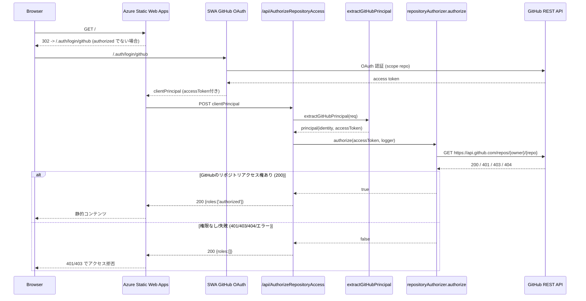

# Azure Static Web Apps - GitHub認証サンプル

GitHubリポジトリのドキュメントをAzure Static Web Apps(SWA)で公開し、対象リポジトリのread権限を持つユーザーだけに閲覧を許可するためのサンプルです。

## 目的

- SWAで公開したサイトを、read権限を持つユーザーだけに閲覧を許可する
- そのために必要な下記の2つを共有する
  - SWAリソースの作成とGitHubシークレット/アプリ設定の登録を自動化するPowerShellスクリプト
  - GitHub OAuthを利用して認可するカスタム認証の実装例

## 前提

- Azure Static Web AppsのStandardプランが利用可能
- GitHubが利用可能であること

## 環境

- Windows 11
- Azure CLI
- GitHub CLI
- PowerShell 7+

## 構築手順

### 1. リポジトリ取得と初期化

```bash
git clone https://github.com/nuitsjp/swa-github-repo-auth.git
cd swa-github-repo-auth
```

### 2. Azure Static Web Appsリソース作成

PowerShellスクリプト`New-SwaResources.ps1`を実行して、必要なAzureリソースを作成します:

```pwsh
cd scripts
./New-SwaResources.ps1
```

#### `scripts/New-SwaResources.ps1` の主な引数

| 引数 | 説明 | 既定値・備考 |
| --- | --- | --- |
| `-ResourceGroupName` | 作成または再利用するリソースグループ名。 | `rg-<repo>-prod` |
| `-Name` | Static Web Apps リソース名。 | `stapp-<repo>-prod` |
| `-ResourceGroupLocation` | リソースグループを配置するリージョン。 | `japaneast` |
| `-SubscriptionId` | 利用するサブスクリプション ID を直接指定。 | 未指定時は `az account show` の結果を確認しながら選択 |
| `-Sku` | Static Web Apps の SKU。 | `Standard` (`Free` も指定可) |
| `-ClientId` | GitHub OAuth App の Client ID。 | 未指定時は対話入力 |
| `-ClientSecret` | GitHub OAuth App の Client Secret。 | 未指定時は安全な対話入力 |

#### 使い方例

```pwsh
# 既定値を上書きしながら静的Webアプリを構築
pwsh ./scripts/New-SwaResources.ps1 `
  -ResourceGroupName rg-swa-github-auth-prod `
  -Name stapp-swa-github-auth-prod `
  -ResourceGroupLocation japaneast `
  -SubscriptionId 00000000-0000-0000-0000-000000000000 `
  -Sku Standard `
  -ClientId "<GitHub OAuth Client ID>" `
  -ClientSecret "<GitHub OAuth Client Secret>"

# 引数を省略するとリポジトリ名からの推測値と対話プロンプトで進行
pwsh ./scripts/New-SwaResources.ps1
```

## SWAアクセス時の動作

このリポジトリでは、`staticwebapp.config.json` の `rolesSource` に `/api/AuthorizeRepositoryAccess` を指定し、GitHub OAuth で取得したアクセストークンを用いて対象リポジトリの read 権限を判定しています。リクエストからロール決定までの概略シーケンスは以下の通りです。



- `extractGitHubPrincipal` が GitHub 以外のプリンシパルやトークン欠如を検知した場合は即座に匿名相当 (`[]`) を返し、SWA で 401/403 として扱われます。
- `repositoryAuthorizer.authorize` は GitHub REST API の `/repos/{owner}/{repo}` を呼び出し、HTTP 200 なら `['authorized']` を返却し、401/403/404 などは `[]` にフォールバックします。
- ノート: `api/lib/githubPrincipal.js` の `extractGitHubPrincipal` は `req.body.clientPrincipal` から GitHub プロバイダーの情報だけを抽出し、`userId`/`userDetails`/`accessToken` を正規化して返します。GitHub 以外の ID やトークン欠如時は `null` を返して以降の処理が匿名扱いになるようガードしています。
