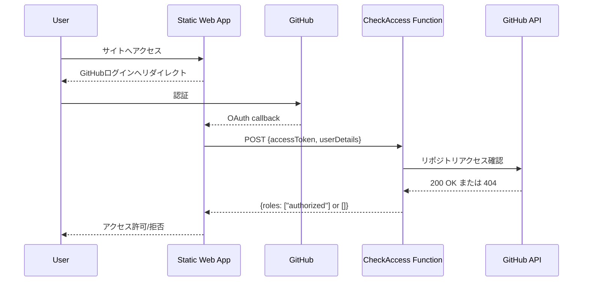

# Azure Static Web Apps - GitHubリポジトリドキュメント公開システム実装ガイド

Private/InternalなGitHubリポジトリのドキュメントをAzure Static Web Appsで公開し、リポジトリのread権限を持つユーザーのみにアクセスを許可するシンプルな実装ガイドです。

## システム概要

- **目的**: Private/Internalリポジトリのドキュメントを、権限を持つユーザーのみに公開
- **認証方式**: GitHub OAuth（リポジトリread権限の確認）
- **アクセス制御**: サイト全体が認証必須（read権限がある＝全体アクセス可）
- **必要プラン**: Azure Static Web Apps Standard（月額$9）

## アーキテクチャ



## プロジェクト構造

```
your-docs-site/
├── docs/                        # 公開するドキュメント
│   ├── index.html
│   └── *.md / *.html
├── api/
│   ├── src/
│   │   └── functions/
│   │       └── checkAccess.js  # 権限確認Function
│   ├── package.json
│   ├── host.json
│   └── local.settings.json     # ローカル環境変数
├── staticwebapp.config.json    # SWA設定
└── package.json
```

## 実装手順

### 1. GitHub OAuth Appの作成

1. GitHub > Settings > Developer settings > OAuth Apps > New OAuth App
2. 以下を設定:
   - Application name: `Your Docs Site`
   - Homepage URL: `https://your-site.azurestaticapps.net`
   - Authorization callback URL: `https://your-site.azurestaticapps.net/.auth/login/github/callback`
3. Client IDとClient Secretを保存

### 2. Azure Functions実装（api/src/functions/checkAccess.js）

```javascript
const { app } = require('@azure/functions');
const axios = require('axios');

// 環境変数から対象リポジトリ情報を取得
const REPO_OWNER = process.env.GITHUB_REPO_OWNER;
const REPO_NAME = process.env.GITHUB_REPO_NAME;

app.http('CheckAccess', {
  methods: ['POST'],
  authLevel: 'anonymous',
  handler: async (request, context) => {
    try {
      const userInfo = await request.json();
      
      // GitHub認証でない場合は拒否
      if (userInfo.identityProvider !== 'github') {
        return { status: 200, jsonBody: { roles: [] } };
      }

      const accessToken = userInfo.accessToken;
      if (!accessToken) {
        context.log('No access token provided');
        return { status: 200, jsonBody: { roles: [] } };
      }

      // リポジトリへのアクセスを確認
      const hasAccess = await checkRepositoryAccess(
        REPO_OWNER,
        REPO_NAME,
        accessToken,
        context
      );

      // アクセス権がある場合はauthorizedロールを付与
      const roles = hasAccess ? ['authorized'] : [];
      
      context.log(`User ${userInfo.userDetails}: access ${hasAccess ? 'granted' : 'denied'}`);
      return { status: 200, jsonBody: { roles } };

    } catch (error) {
      context.error('Error in CheckAccess:', error);
      // エラー時は安全側に倒してアクセス拒否
      return { status: 200, jsonBody: { roles: [] } };
    }
  }
});

async function checkRepositoryAccess(owner, repo, token, context) {
  try {
    // リポジトリ情報を取得（アクセス権がなければ404エラー）
    const response = await axios.get(
      `https://api.github.com/repos/${owner}/${repo}`,
      {
        headers: {
          'Authorization': `Bearer ${token}`,
          'Accept': 'application/vnd.github+json'
        }
      }
    );
    
    // レスポンスが返ってきた = read権限あり
    return true;
    
  } catch (error) {
    if (error.response?.status === 404) {
      // 404 = アクセス権なし
      context.log('Repository access denied (404)');
      return false;
    }
    // その他のエラーも安全のためアクセス拒否
    context.error('GitHub API error:', error.message);
    return false;
  }
}
```

### 3. package.json設定（api/package.json）

```json
{
  "name": "swa-docs-api",
  "version": "1.0.0",
  "main": "src/functions/*.js",
  "dependencies": {
    "@azure/functions": "^4.0.0",
    "axios": "^1.6.0"
  },
  "devDependencies": {
    "azure-functions-core-tools": "^4.x"
  }
}
```

### 4. Azure Functions設定（api/host.json）

```json
{
  "version": "2.0",
  "logging": {
    "applicationInsights": {
      "samplingSettings": {
        "isEnabled": true,
        "excludedTypes": "Request"
      }
    }
  },
  "extensionBundle": {
    "id": "Microsoft.Azure.Functions.ExtensionBundle",
    "version": "[4.*, 5.0.0)"
  }
}
```

### 5. SWA設定（staticwebapp.config.json）

```json
{
  "$schema": "https://json.schemastore.org/staticwebapp.config.json",
  "auth": {
    "rolesSource": "/api/CheckAccess",
    "identityProviders": {
      "github": {
        "registration": {
          "clientIdSettingName": "GITHUB_CLIENT_ID",
          "clientSecretSettingName": "GITHUB_CLIENT_SECRET"
        },
        "login": {
          "scopes": ["repo"]
        }
      }
    }
  },
  "routes": [
    {
      "route": "/.auth/login/github",
      "allowedRoles": ["anonymous", "authorized"]
    },
    {
      "route": "/.auth/*",
      "allowedRoles": ["anonymous", "authorized"]
    },
    {
      "route": "/*",
      "allowedRoles": ["authorized"]
    }
  ],
  "responseOverrides": {
    "401": {
      "statusCode": 302,
      "redirect": "/.auth/login/github?post_login_redirect_uri=.referrer"
    },
    "403": {
      "statusCode": 403,
      "statusDescription": "Access Denied",
      "body": "<!DOCTYPE html><html><head><title>Access Denied</title></head><body><h1>Access Denied</h1><p>You don't have permission to access this repository documentation.</p></body></html>"
    }
  },
  "navigationFallback": {
    "rewrite": "/index.html",
    "exclude": ["/api/*", "/.auth/*", "/images/*", "*.{css,js,json}"]
  },
  "globalHeaders": {
    "X-Frame-Options": "SAMEORIGIN",
    "X-Content-Type-Options": "nosniff",
    "Strict-Transport-Security": "max-age=31536000"
  }
}
```

### 6. 環境変数設定

#### ローカル開発用（api/local.settings.json）

```json
{
  "IsEncrypted": false,
  "Values": {
    "FUNCTIONS_WORKER_RUNTIME": "node",
    "GITHUB_CLIENT_ID": "your-github-client-id",
    "GITHUB_CLIENT_SECRET": "your-github-client-secret",
    "GITHUB_REPO_OWNER": "your-org-or-username",
    "GITHUB_REPO_NAME": "your-repo-name"
  }
}
```

**注意**: `local.settings.json`は必ず`.gitignore`に追加してください。

#### 本番環境（Azure Portal）

Azure CLIで設定:

```bash
az staticwebapp appsettings set \
  --name your-swa-name \
  --resource-group your-rg \
  --setting-names \
    GITHUB_CLIENT_ID="xxx" \
    GITHUB_CLIENT_SECRET="yyy" \
    GITHUB_REPO_OWNER="owner" \
    GITHUB_REPO_NAME="repo"
```

### 7. フロントエンド実装例（docs/index.html）

```html
<!DOCTYPE html>
<html lang="ja">
<head>
    <meta charset="UTF-8">
    <meta name="viewport" content="width=device-width, initial-scale=1.0">
    <title>Repository Documentation</title>
    <style>
        body {
            font-family: -apple-system, BlinkMacSystemFont, 'Segoe UI', Helvetica, Arial, sans-serif;
            max-width: 900px;
            margin: 0 auto;
            padding: 20px;
            line-height: 1.6;
        }
        .user-info {
            background: #f6f8fa;
            padding: 10px;
            border-radius: 6px;
            margin-bottom: 20px;
        }
        .logout-btn {
            background: #d73a49;
            color: white;
            border: none;
            padding: 5px 10px;
            border-radius: 4px;
            cursor: pointer;
        }
    </style>
</head>
<body>
    <div id="user-info" class="user-info"></div>
    
    <h1>📚 Repository Documentation</h1>
    <p>This documentation is only accessible to users with read access to the repository.</p>
    
    <nav>
        <ul>
            <li><a href="/getting-started">Getting Started</a></li>
            <li><a href="/api-reference">API Reference</a></li>
            <li><a href="/contributing">Contributing Guide</a></li>
        </ul>
    </nav>

    <script>
        // ユーザー情報を表示
        async function displayUserInfo() {
            try {
                const response = await fetch('/.auth/me');
                const data = await response.json();
                const user = data.clientPrincipal;
                
                if (user) {
                    document.getElementById('user-info').innerHTML = `
                        Logged in as: <strong>${user.userDetails}</strong>
                        <button class="logout-btn" onclick="logout()">Logout</button>
                    `;
                }
            } catch (error) {
                console.error('Failed to get user info:', error);
            }
        }

        function logout() {
            window.location.href = '/.auth/logout?post_logout_redirect_uri=/';
        }

        // ページ読み込み時に実行
        displayUserInfo();
    </script>
</body>
</html>
```

## ローカル開発

### セットアップ

```bash
# 1. 依存関係のインストール
cd api
npm install
cd ..

# 2. SWA CLIのインストール（グローバル）
npm install -g @azure/static-web-apps-cli

# 3. ローカル起動
npx swa start --app-location docs --api-location api --swa-config staticwebapp.config.json
```

### ローカルテスト

1. http://localhost:4280 にアクセス
2. 認証エミュレーターでログインテスト
3. `/.auth/me`でロール確認

## デプロイ

### GitHub Actionsワークフロー（.github/workflows/azure-swa.yml）

```yaml
name: Deploy to Azure Static Web Apps

on:
  push:
    branches: [ main ]
  pull_request:
    types: [opened, synchronize, reopened, closed]
    branches: [ main ]

jobs:
  build_and_deploy:
    runs-on: ubuntu-latest
    name: Build and Deploy
    steps:
      - uses: actions/checkout@v3

      - name: Deploy
        uses: Azure/static-web-apps-deploy@v1
        with:
          azure_static_web_apps_api_token: ${{ secrets.AZURE_STATIC_WEB_APPS_API_TOKEN }}
          repo_token: ${{ secrets.GITHUB_TOKEN }}
          action: "upload"
          app_location: "docs"
          api_location: "api"
          output_location: ""
```

## セキュリティ考慮事項

### 必須設定

1. **リポジトリをPrivate/Internalに設定**
   - Publicリポジトリでは誰でもread権限を持つため不適切

2. **OAuthスコープは`repo`を使用**
   - Private/Internalリポジトリへのアクセス確認に必須

3. **シークレットの管理**
   - GitHub Client Secretは環境変数で管理
   - ソースコードにハードコードしない

4. **エラー時の動作**
   - エラー時は常にアクセス拒否（fail-safe）
   - エラーメッセージで詳細情報を漏らさない

### レート制限対策

GitHub APIのレート制限（認証済み: 5,000/時）を考慮し、必要に応じてキャッシュを実装:

```javascript
// 簡易的なメモリキャッシュの例
const cache = new Map();
const CACHE_TTL = 5 * 60 * 1000; // 5分

async function checkRepositoryAccessWithCache(owner, repo, token, context) {
  const cacheKey = `${token}:${owner}/${repo}`;
  const cached = cache.get(cacheKey);
  
  if (cached && cached.expires > Date.now()) {
    context.log('Using cached access result');
    return cached.hasAccess;
  }
  
  const hasAccess = await checkRepositoryAccess(owner, repo, token, context);
  
  cache.set(cacheKey, {
    hasAccess,
    expires: Date.now() + CACHE_TTL
  });
  
  return hasAccess;
}
```

## トラブルシューティング

### よくある問題と解決方法

| 問題 | 原因 | 解決方法 |
|-----|------|---------|
| ログインループ | rolesSource設定ミス | `/api/CheckAccess`のパスを確認 |
| 常に403エラー | GitHub権限不足 | リポジトリのコラボレーター設定を確認 |
| 404エラー | API Function未デプロイ | apiフォルダが正しくデプロイされているか確認 |
| スコープエラー | OAuthスコープ不足 | staticwebapp.config.jsonで`repo`スコープを設定 |
| 環境変数エラー | 設定名の不一致 | Azure Portalの環境変数名を確認 |

### ログの確認方法

```bash
# Azure CLIでFunction logsを確認
az staticwebapp functions logs show \
  --name your-swa-name \
  --resource-group your-rg
```

## まとめ

このシンプルな実装により、以下を実現できます：

✅ **Private/Internalリポジトリのドキュメントを安全に公開**
- リポジトリへのread権限を持つユーザーのみアクセス可能

✅ **GitHubを唯一の認証基盤として使用**
- 追加のユーザー管理不要
- リポジトリのコラボレーター管理と完全に同期

✅ **最小限の実装で運用可能**
- 1つのAzure Function
- シンプルな設定ファイル
- 明確なアクセス制御（あり/なしの2択）

この構成により、組織内のドキュメント共有を効率的かつセキュアに実現できます。
