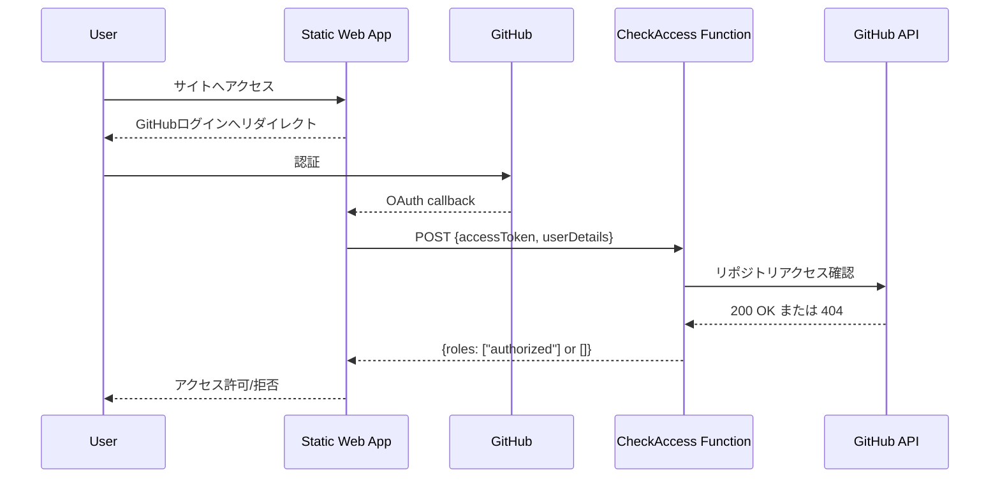

# アーキテクチャ概要

Azure Static Web Apps を使用して Private/Internal GitHub リポジトリのドキュメントを限定公開するための論理構成です。SWA がフロントエンド配信と認証を担当し、Azure Functions が GitHub API と連携してアクセス権を検証します。

## シーケンス



## コンポーネント

- **Static Web App**: `docs/` 以下の静的アセットを配信し、`staticwebapp.config.json` で GitHub OAuth を必須に設定。
- **Azure Functions (`api/CheckAccess`)**: GitHub API を用いてユーザーの対象リポジトリへの read 権限をチェックし、`authorized` ロールを付与。
- **GitHub OAuth App**: `repo` スコープでアクセストークンを払い出し、アクセス検証用の GitHub API 呼び出しを許可。

## ディレクトリ概要

```
swa-github-repo-auth/
├── docs/                  # 公開ドキュメント (index.html ほか)
├── api/                   # Azure Functions (CheckAccess)
├── scripts/               # 環境構築・設定用スクリプト
├── staticwebapp.config.json
├── README.md
└── docs/architecture.md   # 本ドキュメント
```
